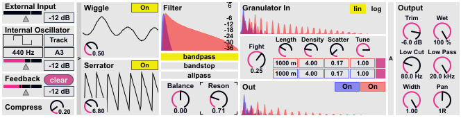

# Feedbacker: An Audio Feedback Software Instrument

### Victor Shepardson | Dartmouth College Digital Musics

## Inspiration

This project was inspired by the notion that [lifelike complexity comes from self perceiving machines][1]. I was also broadly inspired by the idea of chaos in musical synthesis, which has been formally studied [here][2] and [here][3]. However, Feedbacker inhabits the realm of big, complicated, empirically designed chaotic systems which must be navigated by intuition.

Feedbacker is an instrument for gardening minimal material into life and landscapes. Feedbacker is an attempt at the question: "what makes for a compelling audio feedback loop?", the question: "how is a dead, dumb computer made to speak?" or more generally: "how does beauty come from nothing at all?".

## Overview

A good feedback loop (or at least the kind I want Feedbacker to be) needs to push and pull on the important perceptual qualities of its medium; it needs a source and a sink; and it needs a mind with the tools to guide and garden it.

### Push And Pull

Feedbacker's medium is audio. It divides the spectrum into low and high frequencies, processes each half separately, rejoins them and repeats. The heart of Feedbacker is a granulation engine which scatters material in pitch and time. As each half of the spectrum is processed differently, the halves trade material back and forth. Division of the spectrum is done by tracking the spectral centroid: the frequency dividing the spectrum into equal power bands. This is a form of indirect feedback, allowing Feedbacker to adapt to any material and evolve chaotically over time.

The process of repeated granulation tends toward noise, so Feedbacker includes vibrato and enveloping stages to carve new interest out of tired material.

### Source and Sink

A bandpass or bandstop filter pulls material out of the loop. An internal oscillator puts material in. The internal oscillator can track the spectral centroid as its fundamental frequency, another form of indirect feedback. Feedbacker also accepts an input signal through Max or as a Live audio effect, opening it up to develop any material.

### Gardening

Feedbacker is my modest attempt at a world in a box; it demands to be tended, not controlled. To that end carefully chosen but transparent parameters are exposed as knobs, faders, and number boxes to be automated or mapped to the player's hardware of choice. It's possible to configure Feedbacker as a straightforward stochastic delay effect and leave it be, or ride the knobs of a chaotic feedback process. I believe Feedbacker lends itself best to experimental, discovery-based performance.

## Implementation

Feedbacker is built in Max 6 for use with Max/MSP or Ableton Live via Max for Live. Feedbacker depends only on vanilla Max objects and gen~.

## Modules

Feedbacker is organized in nested bpatchers; each lowest-level bpatcher is a distinct module. Centroid detection exists outside of all modules in the top level bpatcher. Generally, signal flows from top to bottom within modules and left to right between modules. Signal from the granulation module is split and fed back to the input module and passed through the output module to Live or Max.

### Input

The leftmost module in the Feedbacker interface provides an internal oscillator with control over volume, pitch and selection of waveform. The oscillator pitch can also be made to track the centroid frequency.

This module also provides control over external input and feedback via a gain fader, and a method of peak control. The compression knob interpolates between two methods: soft clipping by a sigmoid function, and compression-limiting which attempts to maintain an envelope at 0dB.

Compression is applied after the volume faders; i.e. turning the compression knob to the right will result in a combined oscillator and fed back signal volume of 0dB. The faders will then control the relative volume of oscillator to feedback. A second example: turning the compression knob to the left and feedback to -inf dB will result in no feedback, with oscillator amplitude controlled directly by the internal oscillator fader.

### Modulation

The next module provides two types of modulation: a stochastic vibrato called Wiggle, and a reverse delay/sawtooth tremolo called Serrator. Each has one dimension of control and the option to bypass.

Wiggle is implemented as a variable length delay line, with the length modulated by a sine wave plus band limited noise. The rate of modulation is also modulated by band limited noise. An abstract depth control scaling the amount of delay is exposed to the player.

Serrator divides the signal into blocks at a rate which is exposed to the player. Each block is reversed and added to the original signal; then a sawtooth envelope is applied in such a way that the cut point is obscured.

### Filters

The filter module splits the signal into equal power low and high frequency halves, using a crossover filter pair around the spectral centroid. Optional bandpass and bandstop filters share the same center frequency; the resonance of these filters are exposed to the player. A control balancing the amplitude of low and high frequency parts is also available. The low and high components are passed as two channels to the next module. A graph of gain as a function of frequency shows the filter response for each channel, with the low frequency channel colored blue and the high colored red.

### Granulation

The granulation module processes each channel (low and high frequency) separately; the low frequency channel is colored blue, while the high frequency channel is red. At the top and bottom spectroscopes visualize the spectra of each channel before and after granulation, respectively. 

The granulators divide the input signals into discrete grains by tapping a delay line and applying an envelope. Each granulator is a cascade of three identical stages. The emphasis is on long grains rather than microsound. Grains are triggered and panned in the stereo field by a regular pattern of phase rhythms, with additional stochastically chosen parameters for each grain: amplitude, duration, rate, and initial delay. These are abstracted into the exposed parameters: fight, length, density, scatter, and tune.

- Fight controls average transposition (by changing rate) of the two granulators. A positive value of fight causes the low-frequency granulator to transpose up and the the high granulator to transpose down, while a negative value does the opposite.
- Length controls both the average duration of a grain and the maximum initial delay time. The maximum duration of a grain is also limited by how high its playback rate is.
- Density controls the average number of grains playing at once via the tempo of the phase rhythm process which triggers them. It also applies gain to keep the volume relatively level.
- Scatter controls the variance of playback rates. Scatter is the number of octaves up and down from which a grain's rate can be drawn; high values of scatter also introduce a chance of applying an additional factor of 1.5 to the playback rate of a grain.
- Tune controls how closely playback rates are quantized to harmonic intervals. At zero, rates are uniformly distributed in the interval specified by the fight and scatter controls. At one, all rates are rounded to the nearest interval in an equal tempered tuning.

### Advanced Controls

Signal does not flow through this module; rather it contains some global controls and controls for other modules. A master ramp time control affects smoothing of the centroid frequency, internal oscillator pitch, and filter resonance. Minimum and maximum reported centroid frequencies can be set to prevent extreme filter or oscillator frequencies. Some additional granulator parameters are available: the minimum volume of grains (maximum is fixed at 0dB), the number of divisions of the octave for the equal tempered tuning, and the envelope shape.

### Output

The final module provides gain, filtering and stereo field controls over the output signal. Signal through the output stage is not fed back to the input.

## To Use

Open feedbacker.amxd as a Max For Live audio effect in Live 9 or Max 7, open feedbacker.maxpat in Max 6, or create a feedbacker-gui object inside of a bpatcher.

[1]: http://en.wikipedia.org/wiki/G%C3%B6del,_Escher,_Bach "Hofstadter, Douglas R. (1999) [1979], Gödel, Escher, Bach: An Eternal Golden Braid, Basic Books, ISBN 0-465-02656-7"

[2]: http://www.mitpressjournals.org/doi/pdf/10.1162/014892699559869 "Rodet, X., & Vergez, C. (1999). Nonlinear dynamics in physical models: Simple feedback-loop systems and properties. Computer Music Journal, 23(3), 18-34."

[3]: http://www.ee.berkeley.edu/~chua/papers/Mayer-Kress93.pdf "Mayer-Kress, G., Choi, I., Weber, N., Barger, R., & Hubler, A. (1993). Musical signals from Chua's circuit. Circuits and Systems II: Analog and Digital Signal Processing, IEEE Transactions on, 40(10), 688-695."